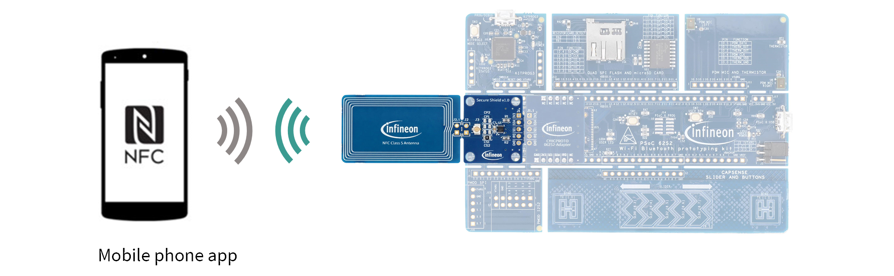
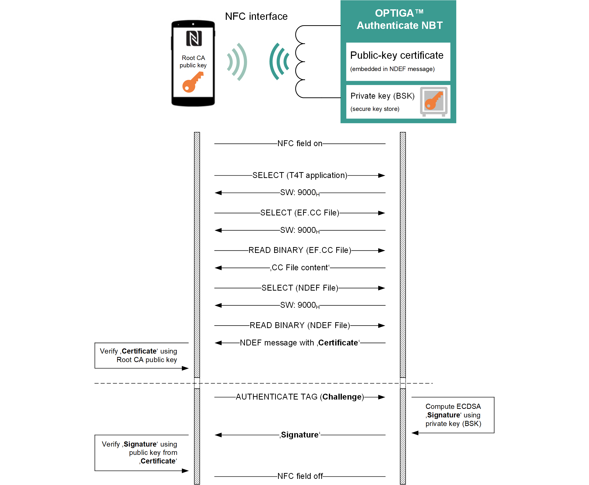
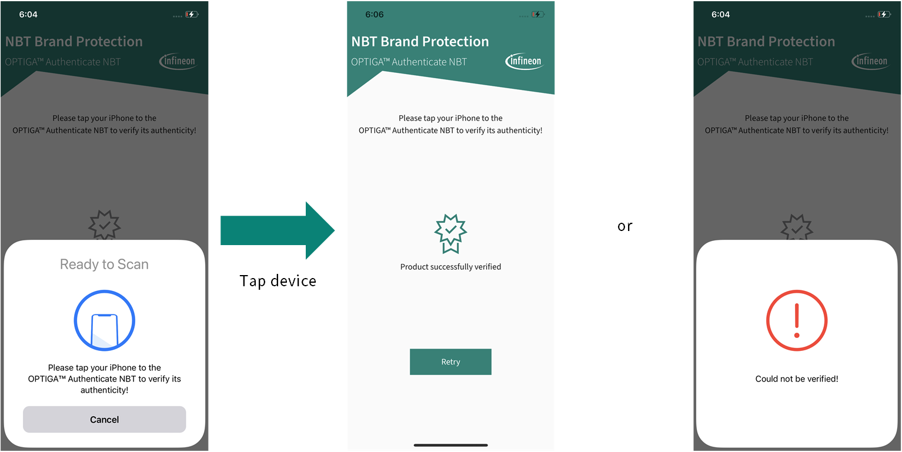

<!--
SPDX-FileCopyrightText: 2024 Infineon Technologies AG
SPDX-License-Identifier: MIT
-->

# OPTIGA™ Authenticate NBT BP Application for iOS

This is the *NBT Brand Protection* mobile phone app, a Swift-based *Xcode* project which showcases the OPTIGA™ Authenticate NBT in the *brand protection (BP) with offline authentication* use case.

## Overview

The example application enables an iPhone to perform an offline validation of a product equipped with an OPTIGA™ Authenticate NBT.
The main purpose of this implementation is to showcase the OPTIGA™ Authenticate NBT's capabilities to enable *BP with offline authentication* and to provide a simple example on how to use the [OPTIGA™ Authenticate NBT Host Library for Swift](https://github.com/infineon/optiga-nbt-lib-swift) in iOS applications.

Refer to the [OPTIGA™ Authenticate NBT - GitHub overview](https://github.com/Infineon/optiga-nbt) for an overview of the available host software for the OPTIGA™ Authenticate NBT. The [OPTIGA™ Authenticate NBT - product page](https://www.infineon.com/OPTIGA-Authenticate-NBT) includes a dedicated Use Case Guide with detailed information on how to use the OPTIGA™ Authenticate NBT's BP functionality.

### Features

- iOS application with user interface and NFC communication capability
- Example implementation of the OPTIGA™ Authenticate NBT's *brand protection* functionality
- Sample usage of the [OPTIGA™ Authenticate NBT Host Library for Swift](https://github.com/infineon/optiga-nbt-lib-swift) (version 1.1.1)
- Uses Swift `Security` package to implement essential cryptographic functionalities to validate the OPTIGA™ Authenticate NBT's certificate

## Getting started

Information on how to setup and use this example application to evaluate the OPTIGA™ Authenticate NBT's *brand protection (BP) with offline authentication* use case.

### Requirements

- NFC-enabled iOS device running iOS 15 and higher
- [OPTIGA™ Authenticate NBT Development Kit](https://www.infineon.com/OPTIGA-Authenticate-NBT-Dev-Kit) or [OPTIGA™ Authenticate NBT Development Shield](https://www.infineon.com/OPTIGA-Authenticate-NBT-Dev-Shield)
- Associated example applications
  - *NBT Brand Protection* mobile phone app ([Android](https://github.com/Infineon/optiga-nbt-example-adt-android) or [iOS](https://github.com/Infineon/optiga-nbt-example-adt-ios) - **\*this application\*** )
    - Mobile phone example application for the *BP with offline authentication* use case
  - *NBT Personalization* mobile phone app ([Android](https://github.com/Infineon/optiga-nbt-example-perso-android) or [iOS](https://github.com/Infineon/optiga-nbt-example-perso-ios))
    - Mobile phone example application for the *personalization of the OPTIGA™ Authenticate NBT via NFC*
    - To configure the OPTIGA™ Authenticate NBT for the desired use case or to reset it to its delivery condition

### Setup

This project is shared to be loaded and compiled using *Xcode*. To do this, it is sufficient to download and import the project into *Xcode* (by selecting File --> Open).

The mobile phone app(s) need to be installed on the mobile phone

- For installing iOS applications, it is recommended to use *Xcode*
- For installing Android applications, it is recommended to use *Android Studio*

### Usage

To evaluate the use case, follow these steps:

- Make sure that NFC is enabled on the iOS device
- Launch the *NBT Brand Protection* mobile phone app
- Tap the mobile phone to the OPTIGA™ Authenticate NBT and validate its authenticity

## Operational use case flow

The main configuration for this use case will be the NFC-only tag setup (no connection to a host microcontroller).
The mobile phone can communicate with the OPTIGA™ Authenticate NBT via the NFC interface and make use of the NDEF message (holding the essential public-key and certificate) hosted by the OPTIGA™ Authenticate NBT to execute the *brand protection* use case.

Using the public-key cryptography and the public-key infrastructure (PKI), the iPhone application can validate the *OPTIGA™ Authenticate NBT*. The PKI allows the iPhone to perform local verification using the trusted certification authority (CA) certificate. The high-level flow of the use case is as follows:

1. The end user launches the *NBT Brand Protection* application on the mobile phone and taps the NFC tag
2. The mobile phone application reads the certificate from the NDEF file
3. The mobile phone validates the certificate using the root CA public-key
4. The mobile phone performs an active tag authentication by sending a challenge and retrieving a signature
5. The mobile phone verifies this signature and displays the result

## Graphical User Interface (GUI)

The GUI is intended to inform the user about the validity of the OPTIGA™ Authenticate NBT sample.

When tapping a *brand protection*-configured OPTIGA™ Authenticate NBT to the NFC antenna of the mobile phone, the NDEF file holding the certificate is read and verified. Afterwards, the application will notify the user about the validity of the certification data on the OPTIGA™ Authenticate NBT.
After a few seconds, the user interface will reset to its initial state and wait for another OPTIGA™ Authenticate NBT tag to verify.

## High-level application flow

The first and only view to be started is the `HomeView`, which is waiting for the *OPTIGA™ Authenticate NBT* sample to be read out.
Once the NFC tag with an NDEF file is detected, an intent is called to read out and process the content of the file.

Further processing steps are handled by the `BpUseCaseManager` class and its underlying methods, which are triggered by the `performBrandVerification()` method. The respective steps include:

1. Parse the certificate from the tags NDEF message (By the NDEF handler interface (`INdefHandler`) and `InfineonHandler` (using libraries by Infineon Technologies) - can also be done by the `IOSHandler` using iOS libraries)
2. Verify the certificate (`verifyCertificate()`)
3. Send an authenticate command (`authenticate()`) with a random challenge (generated in the constructor) to recieve a signature from the *OPTIGA™ Authenticate NBT*
4. Extract the public key from the root certificate and verify the signature received in the previous step (`verifySignature()`)

All the essential cryptographic-specific functionalities in this example application are provided by the Swift `Security` package.

## Additional information

### Related resources

- [OPTIGA™ Authenticate NBT - product page](https://www.infineon.com/OPTIGA-Authenticate-NBT)
- [OPTIGA™ Authenticate NBT - GitHub overview](https://github.com/Infineon/optiga-nbt)

### Contributing

Please read [CONTRIBUTING.md](CONTRIBUTING.md) for detailed contribution instructions and refer to our [CODE_OF_CONDUCT.md](CODE_OF_CONDUCT.md).

### Contact

In case of questions regarding this repository and its contents, refer to [MAINTAINERS.md](MAINTAINERS.md) for the contact details of this project's maintainers.

## Licensing

Please see our [LICENSE](LICENSE) for copyright and license information.

This project follows the [REUSE](https://reuse.software/) approach, so copyright and licensing information is available for every file (including third party components) either in the file header, an individual *.license file or the .reuse/dep5 file. All licenses can be found in the [LICENSES](LICENSES) folder.
